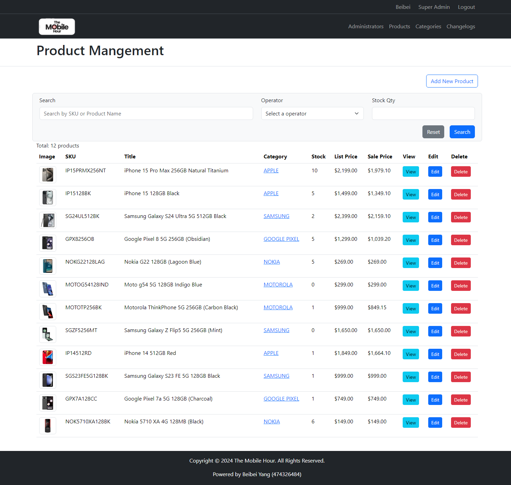

# The Mobile Hour

**The Mobile Hour** PHP&MySQL application features front-end product catalogue and admin dashboard with full CRUD functionalities.

## Live Demo

Check out the live site: [The Mobile Hour](https://themobilehour.beibeiyang.app/)

## Features

- Structured with MVC pattern (Model-View-Control)
- MVC functions written in OOP
- data input validation and sanitisation
- HTML editor sanitisation using HTMLPurifier and QuillJS
- Connected to MySQL database
- CRUD functionalities on products, categories and users
- frontend product search and filter
- Admin user authentication and authorisation
- Mobile responsive with Bootstrap CSS framework

## Built With
- PHP
- MySQL
- XAMPP
- Bootstrap
- Composer
- HTMLPurifier
- QuillJS

## Contact

Beibei Yang - [LinkedIn](https://www.linkedin.com/in/beibei-yang/) - [beibeiyang88@hotmail.com](mailto:beibeiyang88@hotmail.com)

## License

The project is licensed under [Apache license 2.0](https://www.apache.org/licenses/LICENSE-2.0.txt).